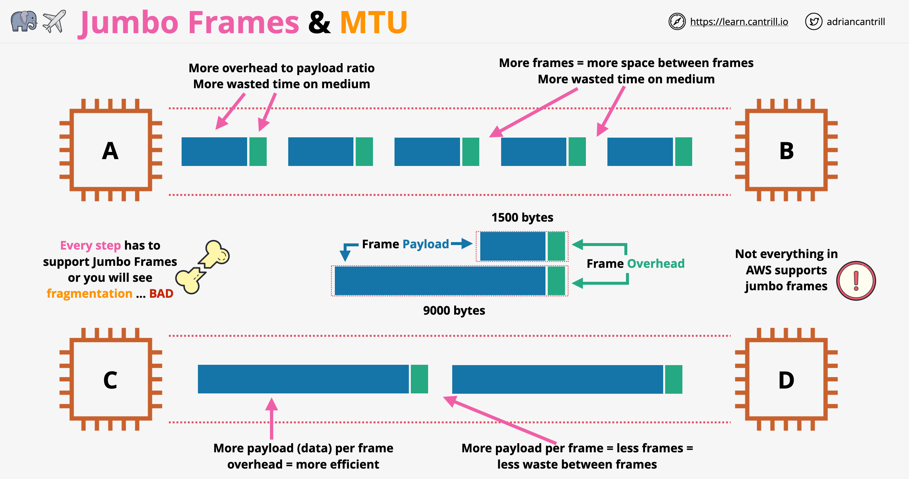

# Jumbo Frames and MTU

- Maximum Ethernet v2 frame size 1500 bytes
- Anything bigger than this is classified as Jumbo frame
- Generally when most people refer to a frame as Jumbo frame, they mean a frame with a max size of 9000 bytes
- With normal frames we can have a high ration of frame overheads. Also, there is a space between frames when no data is transmitted, with normal frames there will be many mores spaces which will result in more wasted time
- With Jumbo frame we have more payload data per frame, which means we need less frames to transfer the same amount of data and consequently we will encounter less wasted space between frames

- Considerations:
    - Ethernet generally queries higher level data inside frames, if we communicate between devices using IP, we need to make sure every step supports the same size of Jumbo frames, otherwise we will see fragmentation
    - Not everything supports Jumbo frames
- AWS Support for Jumbo frames:
    - Any traffic outside of a VPC does not support Jumbo frames
    - Traffic over an inter-region VPC peering does not support Jumbo frames
    - Same region VPC peering is compatible
    - Traffic over a VPN does not support Jumbo frames
    - Traffic using an IGW does not support Jumbo frames
    - Direct Connect and Transit Gateway can support Jumbo frames which are larger then usual, but up to 8500 bytes