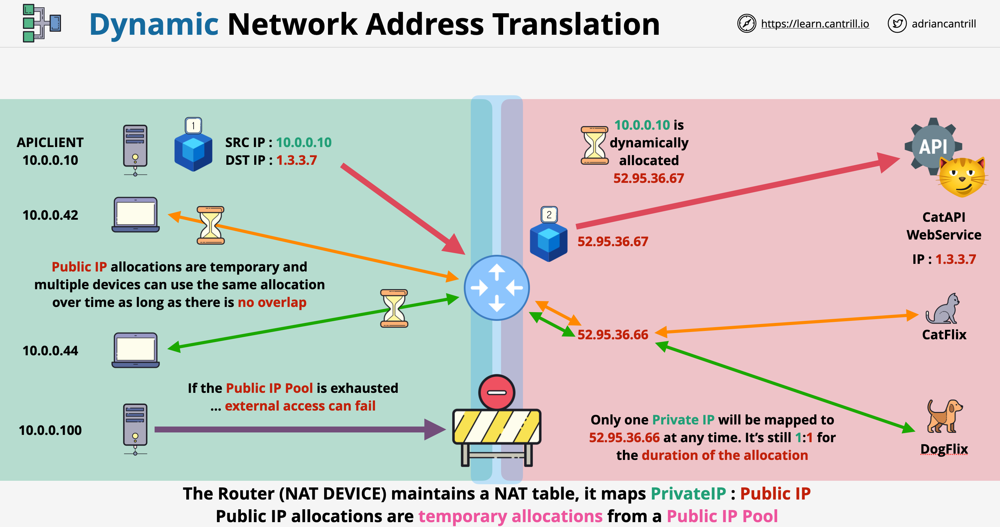
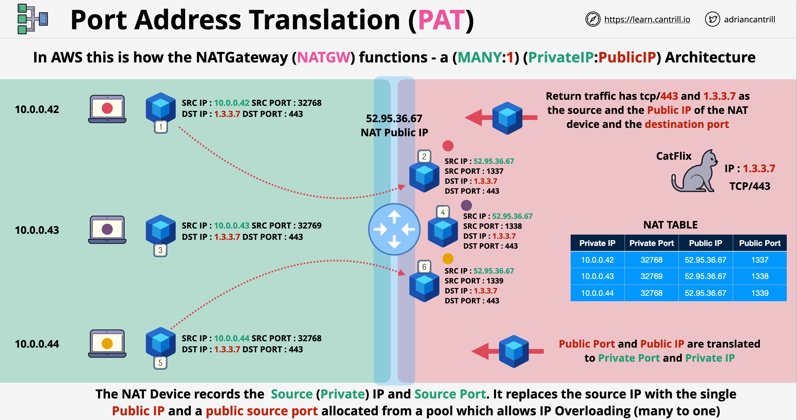

# NAT - Network Address Translation

- It is a process to designed the growing shortage of IPv4 addresses
- IPv4 address are either publicly routable or private addresses
- Public addresses have to be unique in order to function correctly
- Private addresses can be used in multiple places but can't be routed over the internet
- In order to give internet access to devices from a private network, we can use the NAT process
- Types of NAT:
    - Static NAT: 1 private address to 1 (fixed) public address (IGW in AWS)
    - Dynamic NAT: 1 private address to first available public address
    - Port Address Translation (PAT): many private addresses to 1 public (NAT GW in AWS)
- NAT only makes sense for IPv4, for IPv6 we don't need any form of translation

## Static NAT

- The router maintains a 1:1 NAT table where a private IP address is mapped to a public IP
- Packets are generated as normal with a private source IP and an external destination IP
- The router in the local network is the default gateway
- As the packet passes through the NAT device, the source address is translated to the associated public IP address from the NAT table
- For incoming traffic the destination IP address is updated with the corresponding private IP address a forwarded to the device on the network

## Dynamic NAT

- Devices are not allocated a permanent public IP, they are allocated one available from a pool for a temporary usage
- Multiple private devices can share a single private IP as long as there is no overlap
- It is possible to run out of IP addresses to allocate
- This type of NAT process is used when there are fewer public IP addresses than devices and all of the devices need public access which is bidirectional

## Port Address Translation

- Allows a large amount of devices share a public IP address
- This is how the AWS NAT Gateway works
- They way of how PAT works is to use both IP addresses and ports in order to allow sharing the same public IP
- Every TCP connection besides the source and destination IP addresses, has a source and destination port
- The destination port for the outgoing connection is important, the source port is randomly assigned by the client
- As long as the source port is unique, many clients can use the private IP address
- The NAT device creates a NAT table and stores both the destination/source addresses and destination/source ports
- With PAT we can not initiate traffic from the outside to the devices inside the network. Without a NAT entry in the NAT table, the NAT device wont know where to forward the traffic from the outside

