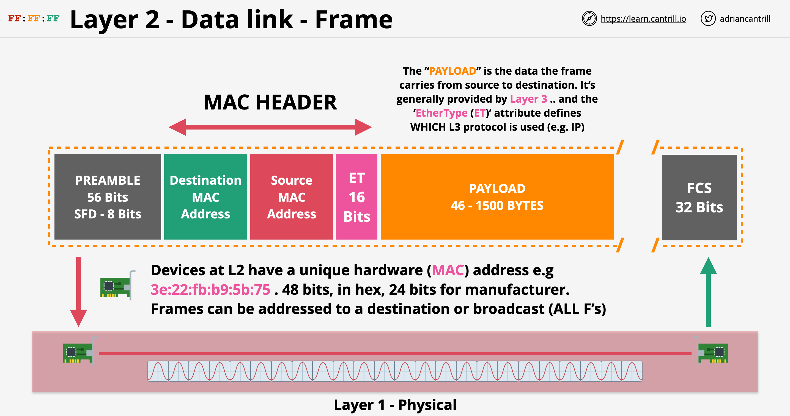
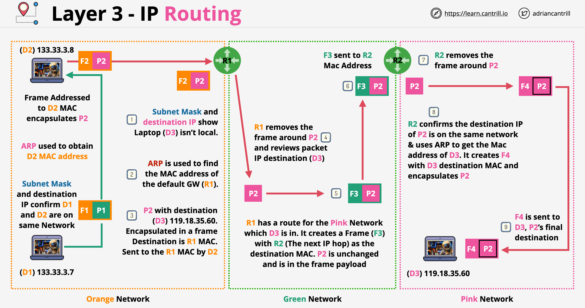
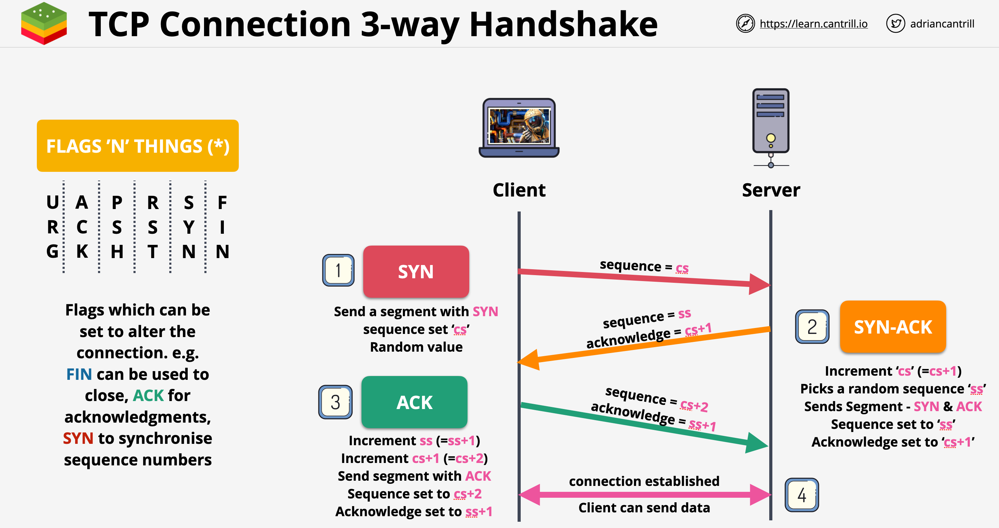
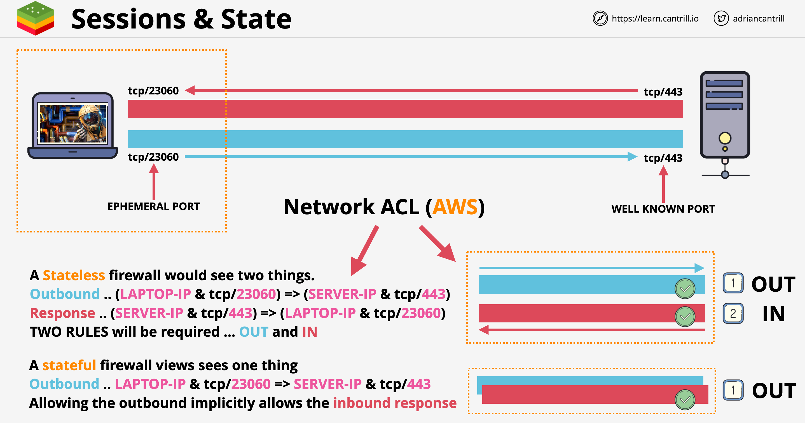

# OSI 7-Layer Model

## Layer 1 - Physical

- Physical mediums can be copper (electrical), Fibre (light) or Wifi (Rf)
- Layer 1 specifications define the transmission and reception of raw bit streams between devices and shared physical mediums
- It defines things like voltage levels, timing, rates, distances, modulation and connectors
- A higher level device can understand the specifications imposed by lower layers (example: a layer 3 device can understand the specifications of layers 1, 2 and 3)
- **Hub**: anything received on one port is retransmitted on every other port (including errors and collisions)
- At layer 1 there are no individual device addresses, all data is processed by all devices
- 2 devices might transmit at once, a collision might occur
- Layer 1 has no media access control
- With layer 1 architectures collisions are very likely to occur, the chances being higher as more devices are added to the network
- Layer 1 is not able to detect when collisions do occur

## Fibre Optic Cables

- Alternative way to transmit data vs copper cables
- Fibre optic cable use a thin glass/plastic core surrounded by protection, the core is the diameter of a human hair
- Fibre optic cable transmit light over the glass/plastic medium
- Fibre optic cables can achieve higher speeds (region of TB/s) and larger distances compared to copper cables
- They are resistant to EMI and less prone to water ingress
- Offers a more consistent experience compared to copper cables
- Fibre diameter is expressed as X/Y: X is the diameter of the core, Y is the diameter fo the cladding (both in microns - 1000 microns in a mm)
- Fibre optic cables: [https://www.rfindustries.com/pdfs/articles/Fiber-Optic-Cable-Types-V2.pdf](https://www.rfindustries.com/pdfs/articles/Fiber-Optic-Cable-Types-V2.pdf)
- Fibre optic cable modes:
    - SINGLEMODE: generally has a yellow jacket and uses lasers, great for long distances and generally high speeds (10GB and above)
    - MULTIMODE: orange/aqua jackets. Has a bigger core, can be used with a wider range of waves of light at the same time, meaning it tends to be faster. It has more distortion and can be used for shorter distances
- Transceivers:
    - SFP Transceiver Module (SFP or MINI GBIC) single form-factor pluggable into networking equipments
    - They generate and send/receive light to/from fibre
    - They are either single or multimode, they are optimized for a single type of cable
    - Specifications: **1000BASE-LX**, **10GBASE-LR**, **100GBASE-LR4**

## Layer 2 - Data Link Layer

- Higher layers build on lower layers, a layer 2 network requires a working layer 1 network to operate on
- Frames: format of sending information in a layer 2 network
- Devices at layer 2 have an uniq address (MAC). MAC addresses are 48 bit addresses, in hex
- A MAC address is not software assigned, it is uniquely assigned by the manufacturer
- A MAC address has 2 parts: the OUI (Organizationally Unique Identifier) and the network interface controller specific part
- Layer 2 frame components:
    - Preamble: indicates the start of the frame
    - Destination/source MAC addresses
        - If the destination address is ALL F's, the frame will be broadcasted to all devices on the network
    - Ether type: which layer 3 protocol puts its data to the frame
    - Payload (46 - 1500 bytes)
    - Frame check sequence: allows the check if the frame was corrupted

- CSMA/CD (Carrier-sense multiple access with Collision Detection): layer 2 checks from any carrier and waits for it until it stops transmitting. When the carrier is not detected any more, layer 2 sends the frame down to layer 1 which will transmit it across the physical medium
    - If a collision is detected, a jam signal is sent by all the devices and a random backup occurs
    - After this backup period the transmitting is retried
- For anything communicating at layer 2 is abstracted from the complexity for layer 1
- **Switch**: it is layer 2 device, works similar to a hub
    - It maintains a MAC address table
    - It can interpret frames and pass the data to the necessary node
    - In case a data frame arrives to a switch:
        - If the switch does not know to which node to transmit according to its MAC address table, the data is transmitted to everyone
        - If it knows where to transmit, the data will be sent to the only node
    - Switches do not forward collisions

## Layer 3 - Network

- Each device on local layer 2 network can communicate with each other but not outside of the local layer 2 network
- Ethernet is a L2 protocol used generally for local networks. Long distance point to point links will use other more suitable protocols such as PPP, MPLS or ATM
- This protocols do not use frames of the same format
- To move data between local networks, we need Layer 3
- Layer 3 adds a few capabilities over L2 networks which are:
    - Internet Protocol (IP): L3 protocol which adds cross-network IP addressing and routing to move data between Local Area Networks without direct P2P links
    - IP packets: are moved from source to destination via intermediate networks
    - **Routers**: devices which moves packets of data between different networks
- Packets: data unit used in the IP protocol, they are similar to frames. The destination and source packets are not local
- There are 2 versions if IP protocol in use:
    - v4: used for decades
    - v6
- IPv4 packets contains a few different fields, more important ones:
    - Source IP
    - Destination IP
    - Protocol: contains data provided by L4, specified which L4 protocol is used (TCP, UDP, ICMP)
    - Data
    - TTL: how many hops through can a packet moved
- IPv6 packet structure:
    - Source/Destination IP: bigger than IPv4
    - Data
    - Hop Limit: similar to TTL
- IP Addressing (v4):
    - Dotted decimal notation: 133.33.3.7
    - All IP addresses are format of 2 different parts:
        - Network part: states which IP network this IP address belongs to
        - Host part: host on that network
    - If the network part matches for 2 different devices, there are on the same IP network
    - IP addresses are statically assigned or by DHCP software
    - IP addresses must be unique
- Subnet Mask:
    - Configured on L3 interfaces
    - Default Gateway: IP address on local network which packets are forwarded to if the destination is not a local IP address
    - Subnet Mask allow to determine if a destination IP is on the same network or not
    - Subnet Mask examples:
        - 255.255.0.0
        - /16 (CIDR notation)
        - Binary format: anything with `1` represents the network component, anything with `0` represents the host component
- Route Tables and Routes:
    - Every router has at least one route table
    - A route table is a collection of routes
    - A route is a destination IP field and next hop/target IP field
    - Routes are selected based on how specific they are: /32 is the most specific while /0 is the least specific route
    - The packet is forwarded to the next hop address
    - Route tables can be statically populated or there are dynamic protocols such as BGP which lets routers exchange network information
- Address Resolution Protocol (ARP):
    - Used when a L3 packet is encapsulated in a frame and sent ot a MAC address
    - We don't initially know the MAC address and need a protocol to find the MAC address for an IP address
    - ARP gives the MAC address for specific IP address
    - ARP broadcasts on L2, it sends a packet for all devices on the network asking who has a specific IP address
- IP Routing

    

## Layer 4/5 - Transport and Session

- Each L3 packet is a separated and isolated thing and it is routed independently over the internet
- The arrival condition of packets may be different compared to the condition when there were generated and sent:
    - Out of order arrival: packets arrive in different order compared to how they were sent
    - Packets can go missing
    - Delay in delivery: some packets may be delayed if the network conditions are wrong
- L3 packets have a source and destination fields, they don't have anything beyond that to distinguish channels of communications => there is no method to distinguish if the different applications are sending/receiving packets
- IP has no flow control: source device can saturate the destination device
- Layer 4 builds on the of L3 and adds 2 new protocols:
    - **TCP (Transmission Control Protocol)**: provides reliability, error corrections and ordering of data. Used of most of the application layer protocols (HTTP, HTTPS, SSH, etc.)
    - **UDP (User Datagram Protocol)**: faster than TCP, does not have the TCP overhead
- Both TCP and UDP run on top of IP, TCP offers reliability while UDP offers performance
- **TCP Segments**:
    - Another container for data, specific to TCP
    - They are encapsulated in IP packets
    - Segments do not have source/destination addresses, they use the IP addressing
    - Important fields (TCP Header):
        - Source/Destination ports: gives the combined TCP/IP protocols, offers the availability to have multiple different conversation between devices
        - Sequence: number that is incremented with each segments. Used for error corrections and packet ordering
        - Acknowledgement: the way to indicate that one side received the segments up to certain sequence number. Every segments needs to be acknowledged
        - Flags 'n' Things: flags + number of extra fields
        - Window: number bytes that we indicate that we are willing to receive between 2 acknowledgments. Used of flow control
        - Checksum: used for error checking and retransmission
        - Urgent pointer: settings this field means both sides have can have separate processing, the control traffic takes priority between other transmission
- TCP is connection based. A connection is established between 2 devices using a random port on a client and know port on the server. Once established the connection is bi-directional
- L4 takes data and chops data into segments, encapsulated into IP packets. TCP gives use the reliable ordered segment based connection
- Well known port: port used for connecting to server application, example: 80, 443
- Ephemeral port: "random" temporary port from a higher prot range created for the TCP channel in order fo the server to be able to respond and establish two-way connection
- TCP Connection 3-way Handshake:
    - Flag fields: can be set to alter the connection, example FIN can be used to close, ACK for acknowledgements, SYN for synchronize sequence number

    

- Sessions and State:
    - We would want to add security to the traffic, the problem is what rules we add, what types of traffic we can allow from where and to where?
    - Stateless firewall:
        - We need 2 rules: one for outbound connection and one for inbound connection (NACL in AWS)
    - Stateful firewall:
        - Understands the state of the TCP segment
        - If we allow the initiating connection, we automatically allow the response (Security Group in AWS)
    
    

