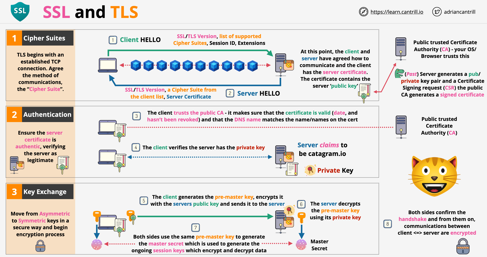

# SSL - Secure Sockets Layer and TLS - Transport Layer Security

- TLS is the newer and more secure version of SSL
- TLS/SSL provides privacy and data integrity between client and server
- TLS provides a few main functions:
    - Ensures privacy: 
        - Communication between entities is encrypted
        - Communication starts with an asymmetric encryption architecture: the server can make its public key available which can be used by the clients
        - It uses symmetric encryption afterwards
    - Identity validation: 
        - Server or client/server verification
        - Generally the client verify the identity of the server
    - Provides reliable connection:
        - Protects against data alteration
    
## TLS Architecture

