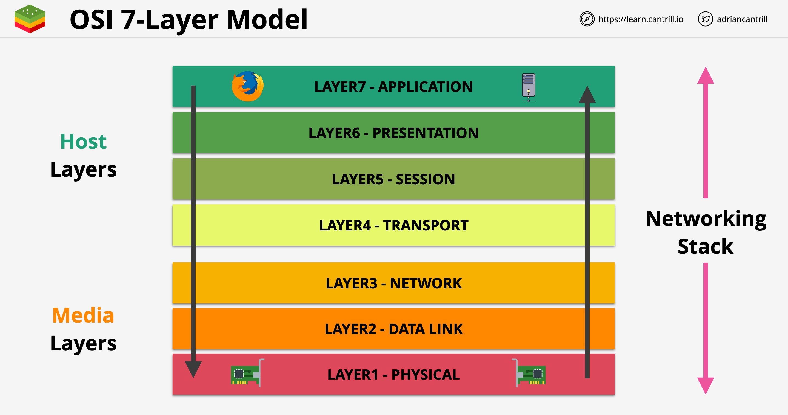

# Networking Started Pack

## OSI 7-Layer Model

## Layer 1 - Physical

- Physical mediums can be copper (electrical), Fibre (light) or Wifi (Rf)
- Layer 1 specifications define the transmission and reception of raw bit streams between devices and shared physical mediums
- It defines things like voltage levels, timing, rates, distances, modulation and connectors
- A higher level device can understand the specifications imposed by lower layers (example: a layer 3 device can understand the specifications of layers 1, 2 and 3)
- Hub: anything received on one port is retransmitted on every other port (including errors and collisions)
- At layer 1 there are no individual device addresses, all data is processed by all devices
- 2 devices might transmit at once, a collision might occur
- Layer 1 has no media access control
- With layer 1 architectures collisions are very likely to occur, the chances being higher as more devices are added to the network
- Layer 1 is not able to detect when collisions do occur

## Fibre Optic Cables

- Alternative way to transmit data vs copper cables
- Fibre optic cable use a thin glass/plastic core surrounded by protection, the core is the diameter of a human hair
- Fibre optic cable transmit light over the glass/plastic medium
- Fibre optic cables can achieve higher speeds (region of TB/s) and larger distances compared to copper cables
- They are resistant to EMI and less prone to water ingress
- Offers a more consistent experience compared to copper cables
- Fibre diameter is expressed as X/Y: X is the diameter of the core, Y is the diameter fo the cladding (both in microns - 1000 microns in a mm)
- Fibre optic cables: [https://www.rfindustries.com/pdfs/articles/Fiber-Optic-Cable-Types-V2.pdf](https://www.rfindustries.com/pdfs/articles/Fiber-Optic-Cable-Types-V2.pdf)
- Fibre optic cable modes:
    - SINGLEMODE: generally has a yellow jacket and uses lasers, great for long distances and generally high speeds (10GB and above)
    - MULTIMODE: orange/aqua jackets. Has a bigger core, can be used with a wider range of waves of light at the same time, meaning it tends to be faster. It has more distortion and can be used for shorter distances
- Transceivers:
    - SFP Transceiver Module (SFP or MINI GBIC) single form-factor pluggable into networking equipments
    - They generate and send/receive light to/from fibre
    - They are either single or multimode, they are optimized for a single type of cable
    - Specifications: **1000BASE-LX**, **10GBASE-LR**, **100GBASE-LR4**