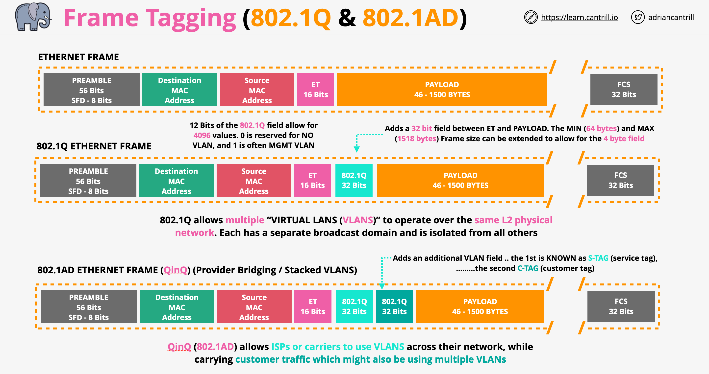
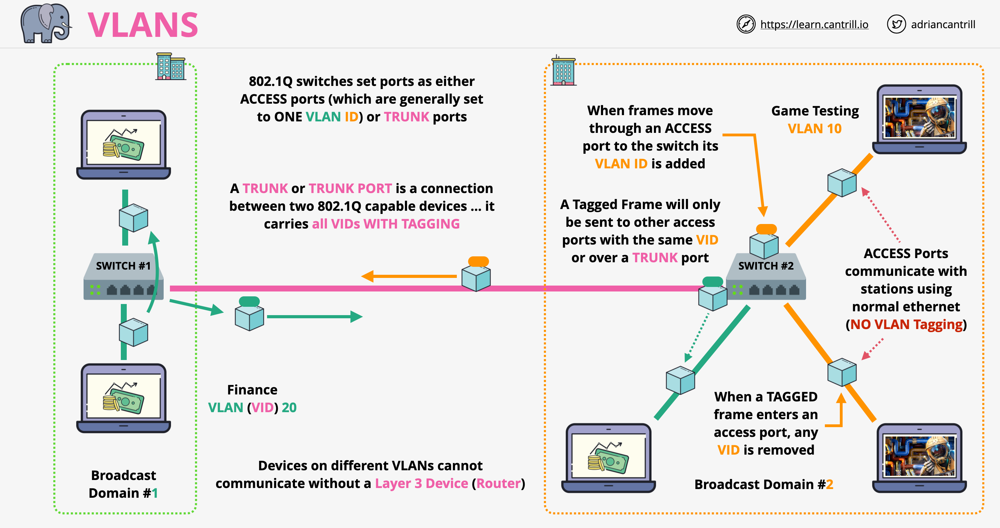

# VLANs, Trunks and Q-in-Q

- Each LAN is a shared broadcast domain, frame addressed with "all FFs" will be received by all stations
- Every additional device can create more traffic
- In a local network we may want to separate devices in segments
- We can have different segments by using VLANs (Virtual Local Area Networks)
- Frame Tagging:

    

- Frame Tagging modifies the structure of the Ethernet frame by adding a 32 bit fields between the ET and the PAYLOAD. This is used for the VLAN id
- 802.1Q allows multiple VLANs to operate over the same L2 network, each having a different broadcast domain and is isolated by others
- 802.1AD (QinQ, Provider Bridging/Stacked VLANs): adds an additional VLAN field, known as S-TAG. The service provider can use VLANs to isolate customer traffic while allowing each customer to use VLANs internally
- Trunks:

    

- Trunk port: connection between 2 802.1Q compatible devices

## Summary

- VLAN allows to create separate L2 network segments
- VLANs provide isolation for traffic
- VLANs offer separate broadcast domains