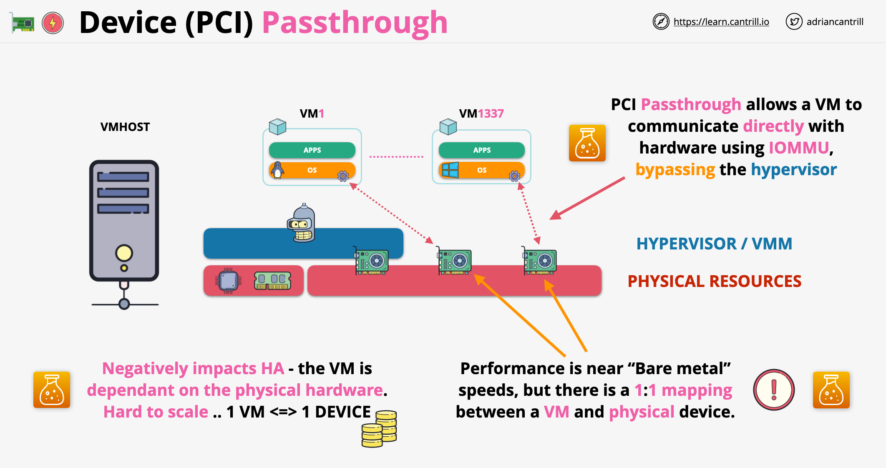
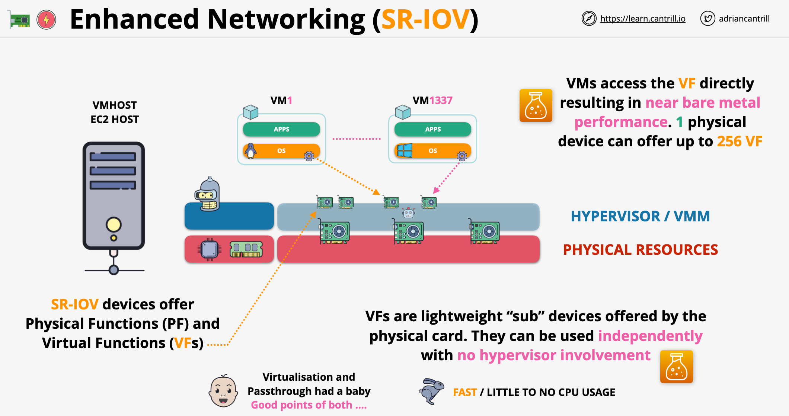
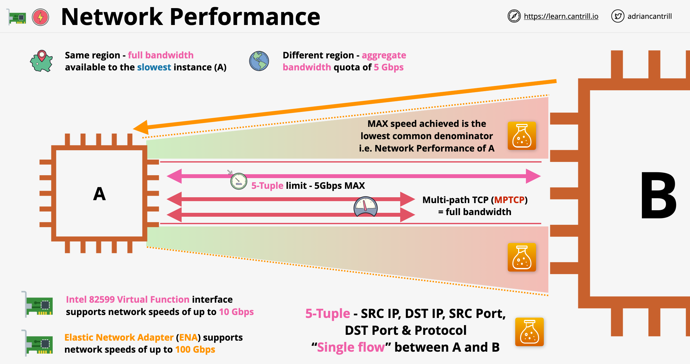

# Advanced EC2 Networking

- EC2 instances are created with a primary ENI (Elastic Network Interface). This cannot be detached or removed
- Additional ENIs can be added at creation time of afterwards
- ENIs should be on the same region in order to be attachable to EC2 instances
- Secondary ENIs can be attached and re-attached to other EC2 instances. EC2 instances can have more than one ENIs attached
- ENIs are tied to AZs. ENIs can be placed on different subnets as long as they remain in the same AZ
- Security Groups are attached to ENIs, not EC2 instances
- Most networking configurations for the EC2 instances are performed on the ENI level, not on the instance level
- Every ENI is allocated a private IPv4 using DHCP. This IP address remains the same for the lifetime of the ENI => every EC2 instance by default has a single primary private IP address that never changes
- This private IP address is exposed to the operating system
- In addition to the primary address, ENIs can also be allocated to one or more secondary private IP addresses. These are also exposed to the operating system of the instance
- IP addresses are linked to the ENI, meaning IPs can be moved between EC2 instances by moving the ENI
- If an instance is launched in a subnet which is set to allocate public IPv4 addresses or if we explicitly decide to launch an instance with a public IPv4 address, the primary ENI is allocated a public IPv4 address. This address is not static, if the instance is stopped/started, this IP is changed.
- The public IP address is not exposed to the operating system, in AWS it is never a valid solution to be exposed
- We can have static public IPs by allocating Elastic IP addresses. These can be associated with an instance (primary ENI) or with an ENI
- If an Elastic IP is associated with an instance, the existing public IP is removed and it is not recoverable
- We can allocate up to one Elastic IP per private IPv4 address. These can be moved between interfaces and instances
- Elastic IP are charged when they are not associated to an instance or if the instance is not running to which they are associated
- ENIs can have one or more public IPv6 addresses, a MAC address and one or more SGs
- If IPv6 is enabled, all IPv6 addresses are publicly routable
- IPv6 are also configured within the operating system network interface
- ENIs can have one or more SGs. SGs are evaluated together, if an allow exists for a specific target, than the traffic is enter/leave the interface
- Each interface has a flag named Source/Destination Check. By default an interface drops traffic if the source or destination  address is not on the interface. If this flag is disabled, this check is not done, traffic wont be dropped. Required to be disabled for NAT instances
- By associating multiple ENIs to the same instance we can:
    - Use different networks for managing the same instance (management or isolated networks, public networks)
    - Use ENIs for software licensing (license based on MAC address)
    - Different network interfaces for security and network appliances
    - Multiple network interfaces for multi-homed instances with workloads/roles on specific subnets
    - Implement a low budget and simple HA solutions

## EC2 Enhanced Networking (SR-IOV)

- SR-IOV - Single Route IO-Virtualization
- Networking in EC2 is traditionally virtualized
- With VM generally each physical network interface (NIC) is shared between instances, and the hypervisor mediates access between the instances
- Wether an OS is running in a virtualized environment or physical environment, it expects to have direct access to the NIC
- It uses a special type of instruction know as privileged instructions. These means that the os has direct access to the HW
- In case of hypervisor, it looks for these calls and it traps them and redirects them to the physical HW. These process comes with a performance hit
- One way to get around this performance hit is to use device passthrough (1 VM <=> 1 NIC). This limits the ability to migrate the instance and impacts the ability of the VM to cope with other HA events
- Other option is SR-IOV: allows multiple VMs to access the same NIC without performance hits
- This feature is implemented as Enhanced Networking in EC2 and is supported across all types of EC2 instances. It is required for higher performance, especially for certain placement groups
- Device (PCI) Passthrough:

    

- Enhanced Networking Architecture (SR-IOV):
    - The network interface cards are virtual aware
    - Each network card is creating virtual function (virtual network cards)
    - This functions offer a cut-down feature set enough to send/receive data
    - The management of the overall card is performed by the physical functions offering full functionality
    - Each physical device can offer up to 256 virtual functions
    - The hypervisor is not involved in networking coordination at all, the performance being near to bear-metal
    - Because the hypervisor is not involved, it means better speed, better packets/sec more consistent speeds and less CPU involvement across the board

    

## Network Performance within AWS

- We should use enhanced networking for anything beyond base level performance requirements
- If we have 2 instances communicating over the network, the best performance we can achieve is the lowest common denominator (we cannot have better speeds than the maximum capability of the slower instance)
- Factors which can influence an instance's network speed is the size and type of the instance. Larger sizes generally offer better network performance
- We can have different types of ENIs: older ENI up to 10GBps, newer up to 100Gbps
- Other much performance caps:
    - Instance in the same region: performance is dictated by the lowest performing instance
    - Instances in different regions can have a max aggregate performance bandwidth quota of 5Gbps
    - 5 Tuple (SRC IP, DST IP, SRC Port, DST Port & Protocol): Single Flow between A and B limit is 5Gbps MAX. Ways around this: Multi-path TCP (MPTCP), other protocols which support multiple streams

    