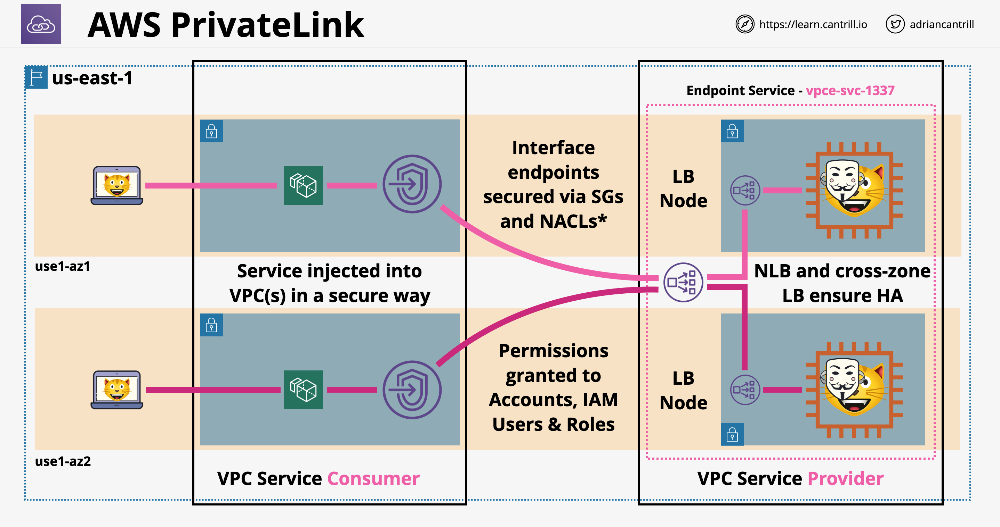

# VPC Endpoints

## AWS PrivateLink

- Tech stack which supports VPC interface endpoints
- Enables us to connects to services in a secure way which are hosted by other AWS accounts. This are called AWS Endpoint Services
- We can connect to these directly or we can utilise AWS partner services from the AWS Marketplace. In both cases these services are presented in our VPC with a private IP address and with ENIs
- AWS PrivateLink architecture:

    

- From a consumer VPC we can access the provided by injecting Interface Endpoints into our subnets
- Interface Endpoints can be secured with SGs and NACLs
- By using AWS PrivateLink, the data does not go through the public internet
- AWS PrivateLink key facts:
    - For HA we should deploy multiple Interface Endpoints, one for each AZ inside the VPC
    - PrivateLink supports IPv4 and TCP only (no IPv6)
    - Private DNS is supported. This can override the public DNS (if public DNS is provided)
    - PrivateLink services can be access via DX, Site-to-Site VPN and VPC Peering