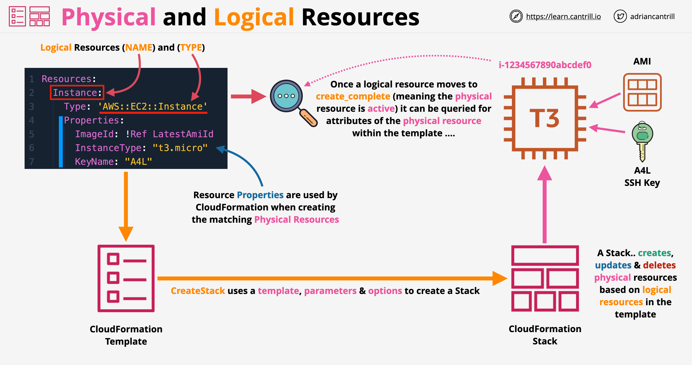
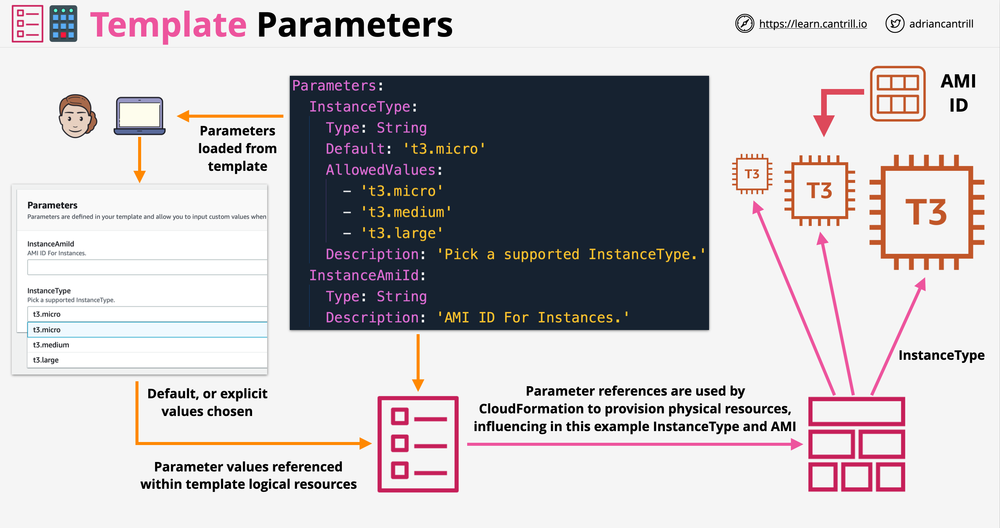

# CloudFormation

## CloudFormation Physical and Logical Resources

- CloudFormation stacks are configured using a template (YAML or JSON)
- Within this template we define logical resources (what we want to create, NOT how we would want to create them)
- A template can be used to create one or more stacks
- The initial job of a stack is to create physical resources based on logical resources defined in the templates
- For every logical resource in a template a physical, a physical resource is created. If the logical resource is updated, the physical resource is also updated. If the stack is deleted, the physical resources will also will be deleted
- Once a logical resource moves in a create complete state (meaning the physical resource successfully created), than the logical resource can be references by other logical resources

    

## CloudFormation Template and Pseudo Parameters

- Template and pseudo parameters allow input, letting external sources provide input into CF
- Example of inputs: size of an EC2 instance, environment, etc.
- Inputs are defined together with logical instances in the templates and they can be references from within logical resources
- For every parameter we can define configurations like:
    - Default values
    - Allowed values and restrictions: `Min`, `Max`, length and `AllowedPatterns`, `NoEcho` (useful for passwords), `Type` (parameter types: String, Number, List, AWS specific types)

    

- Pseudo parameters: parameters which are provided by AWS, examples:
    - `AWS::Region`
    - `AWS::StackId`
    - `AWS::StackName`
    - `AWS::AccountId`
- Pseudo parameters does not need to be defined in the CF `Parameters` section. They are automatically injected into our templates by AWS
- Both type of parameters ensure that our stacks are portable and can adjust based on input from the person/process creating the stack
- We should aim to minimize the parameters which require explicit inputs. Instead we should use default values and pseudo parameters provided by AWS

## CloudFormation Intrinsic Functions

- Intrinsic function allow to gain data when the template creation is executed and perform certain actions with it
- Intrinsic function examples:
    - `Ref` and `Fn::GetAtt`: reference a value from one resource in another one
        - `Ref`: reference the resource main identifier (physical ID)
        - `Fn::GetAtt`: reference any attribute of a resource (example: `PublicDnsName`)
    - `Fn::Join` and `Fn::Split`: join/split strings
    - `Fn::GetAZs` and `Fn::Select`: get a list of availability zones and select one from the list
        - `Fn::GetAZs`: it will return a list with all the existing AZs *where the default VPC has subnets* in the current region or in any specified region
        - `Fn::Select`: accepts a list and an index, returns the value from the list for the index
    - Conditions: `Fn::IF`, `Fn::And`, `Fn::Equals`, `Fn::Not`, `Fn::Or`
    - `Fn::Base64` and `Fn::Sub`: base64 encoding and substitute that into text
        - `Fn::Base64`: accepts a text an converts it into base64 encoding
        - `Fn::Sub`: allows to substitute some values (marked with `${value}`) in text 
    - `Fn::Cidr`: configure/build CIDR ranges
        - Usage: `!Cidr[!GetAtt [VPC.CidrBlock, "16", "12]]`: cidr block, how many subnets, bits per CIDR

## CloudFormation Mappings

- Templates can contain a `Mappings` top level objects, which can contain many mappings, key value pairs allowing lookups
- Mappings can have one level of lookup or top and second level keys
- Mappings use the `Fn::FindInMap` intrinsic function to retrieve elements from the maps
- Mappings are used to improve template portability
- Common use case for mappings is retrieval of AMIs for given region and architecture
- `FindInMap` usage: `!FindInMap [ MapName, TopLevelKey, SecondLevelKey ]`
    - We always need to provide a top level key
    - Second level key is optional

## CloudFormation Outputs

- They are top level objects, they are optional
- Used for provide status information or show how to access services provisioned by the CF stack
- Outputs can be visible when using the CLI, console UI or they can be accessible from a parent stack when using nesting
- Outputs can be exported, allowing cross-stack references

## CloudFormation Conditions

- Allows a stack to react to certain condition and change infrastructure based on those specific conditions
- Conditions are declared in the optional `Condition` section of a template
- We can define many conditions in that section, the end effect being that all conditions are evaluated to either true of false
- Conditions are processed before resources being created
- Conditions use other intrinsic functions like `AND`, `EQUALS`, `IF`, `NOT`, `OR`

## CloudFormation `DependsOn`

- Allows us to establish explicit dependencies between CloudFormation resources
- CloudFormation be default tries to do things (create, update, delete) in parallel, while trying to determine a dependency order between resources
- Dependency order is determined based on references and functions
- `DependsOn` lets us explicitly define if resource B and C depend on resource A. This will result for a wait time for both B and C while A is being created
- One common exception when CF can not detect the dependency between resources is when we want to create an Elastic IP and associate it to an EC2. We cannot attach an Elastic IP before an internet gateway is attached to a VPC
- `DependsOn` accepts a single resource or array of resources