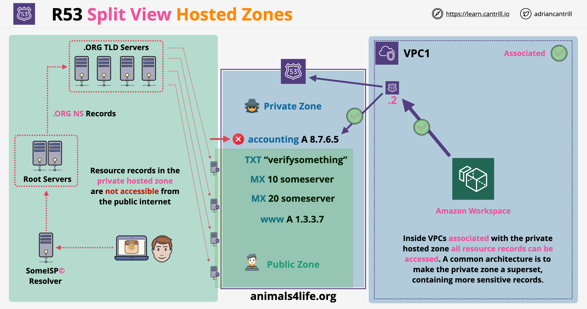

# Route 53

## Route 53 Public Hosted Zones

- A hosted zone is a DNS database for a given section of the global DNS database
- Route 53 is a globally resilient service. The nameservers are distributed globally and have the same dataset
- Hosted zones are created automatically if we register a domain
- We can create them separately if we want to register a domain elsewhere
- There is a monthly fee for the hosted zone and for the number of queries made to the hosted zone
- A zone hosts DNS records, example A, AAAA, MX, NS, TXT, etc.
- Hosted zones are authoritative for a domain, when we register a domain, nameserver records for it will enter into the top level domain zone, which will point to our nameservers. Our nameservers will become authoritative for that domain
- A public hosted zone is DNS database, a zone file hosted by R53 on public nameservers
- They are accessible from the public internet and form our VPCs
- When a public hosted zone is created, R53 allocates 4 nameservers for this hosted zone. These nameservers are accessible from the public internet and from the VPC is DNS is enabled
- From the VPC the access method is direct, the VPC resolver using the VPC +2 address
- From the public internet, we access the root zones first and proceed to walk the tree to get the IP for the DNS

## Route 53 Private Hosted Zones

- Private hosted zones are similar to public hosted zones, but they are not public to the whole internet
- They are associated with VPCs, they can be only access within these VPCs
- We use them to create resource records which are resolvable from the VPCs
- It is possible to use split-view: we can use the same address for public and private DNS
- Split View/Split Horizon DNS:

    

## Route 53 CNAME vs ALIAS

- In DNS an `A` records maps a `NAME` to an IP address, while a `CNAME` record maps a `NAME` to another name (example: `example.io` => `1.3.3.7` and `www.example.io` => `example.io`)
- We cannot use a `CNAME` for the apex domain
- Many AWS services, such as ELBs, do not provide an IP address, only a DNS name, so we can not point the apex domain to these services
- This problem is fixed by the `ALIAS` record
- An `ALIAS` record maps a `NAME` to an AWS resource
- It can be used for both apex and normal records, for non-apex records we can use `CNAME` records
- There is no charge for `ALIAS` requests pointing to an AWS resource
- An `ALIAS` record is a subtype, we can have `A` record alias and a `CNAME` record alias
- The `ALIAS` record is a record implement by AWS and it falls outside of the DNS standard

## Route 53 Simple Routing

- Simple routing starts with a hosted zone
- With simple routing we can create one record per name
- Each record can have multiple values. For the client these records are returned and the client can chose one by random
- Limitation of simple routing is that it does not support health checks