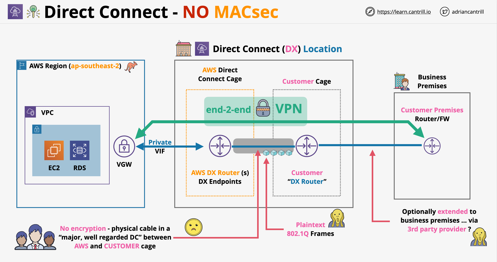
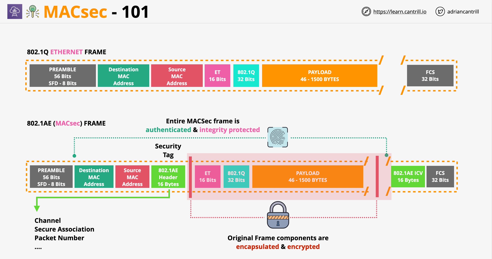
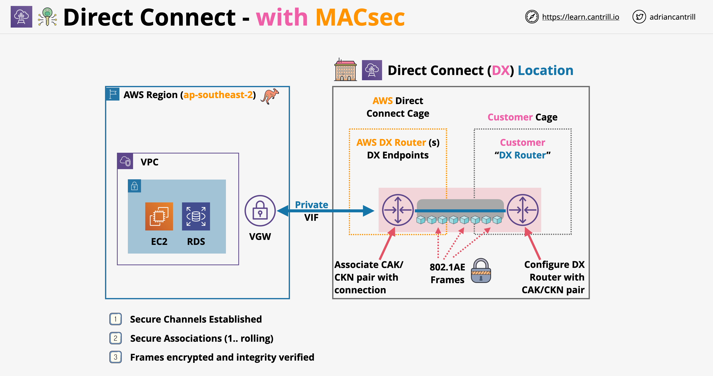
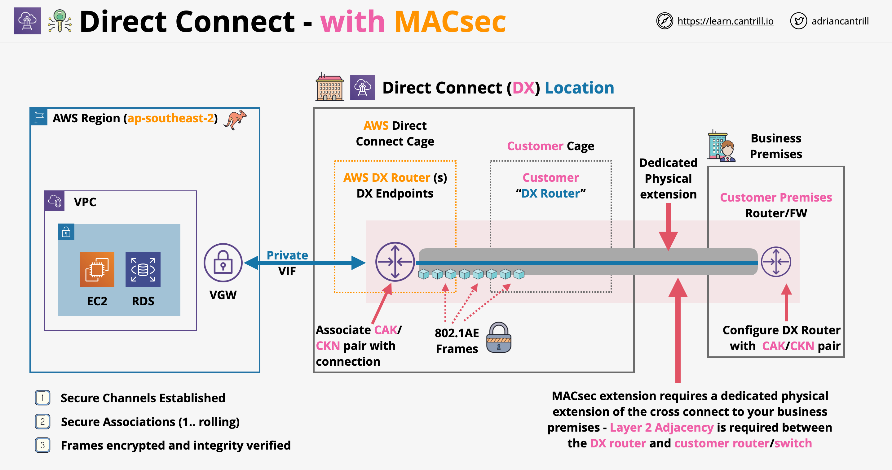
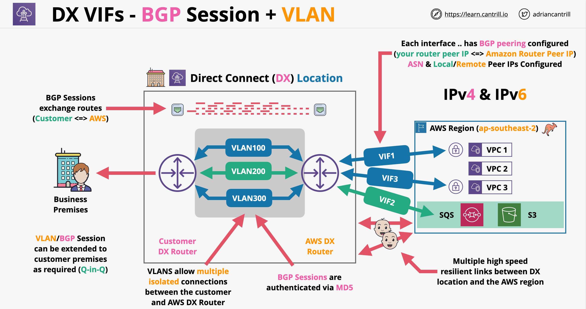
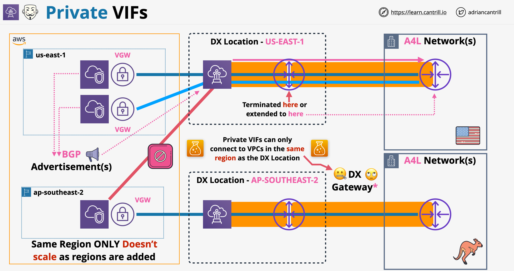
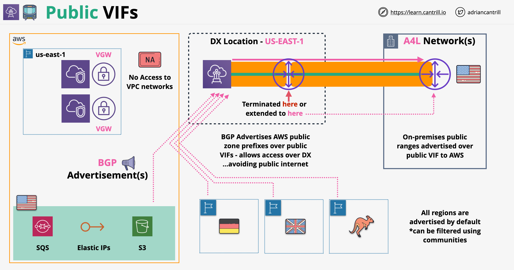
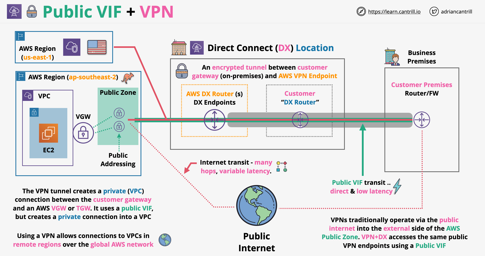

# Direct Connect

## Concepts

- It is a physical connection into an AWS region
- It can be 1, 10 or 100 Gbps connection
- The connection is between the business premisses => DX Location => AWS Region
- When we order a DX connection, actually we order a port allocation at a DX location. It does not provide a connection of any kind by itself, it is just a physical port. It is up to us to connect to this directly or arrange a connection to be extended via a third party comms provider
- The cost for DX includes a hourly cost + cost for the outbound data transfer. Inbound data transfer is free of charge
- To be taken in consideration:
    - Provisioning time: AWS will take time to allocate a port + arrange connection to the premises (weeks/months)
    - No builtin resilience by default
    - Provides low and consistent latency + high speeds
    - DX can be used to access AWS Private Services (running in VPCs) and AWS Public Services

## Physical Connection Architecture

- A direct connect is a physical port allocated at DX location, this physical port provides either 1, 10 or 100 Gbps connection speed
- Port allocated at the DX location requires the use of single-mode fibre, we can't connect using copper connection
- Physical layer connection standards:
    - 1Gbps connection: 1000BASE-LX (1310nm) Transceiver
    - 10Gbps connection: 10GBASE-LR (1310nm) Transceiver
    - 100Gbps connection: 100GBASE-LR4 Transceiver
- In terms of the configuration for the DX ports:
    - We have to make sure that Auto-Negotiation is disabled
    - We configure the port speed
    - Full-duplex has to be manually set on the network connection
- The router on the DX location should support the BGP protocol and BGP MD5 Authentication
- Optional configurations:
    - MACsec
    - Bidirectional Forwarding Detection (BFD)

## Direct Connect MACsec

- Partially improves the long standing problem with DX: lack of built-in encryption
- MACsec is standard, allows Layer 2 frames to be encrypted. It extends standard Ethernet
- MACsec provides a hop by hop encryption architecture. 2 devices need to be next to each other
- MACsec provides the following higher level features:
    - Confidentiality (strong encryption at L2)
    - Data Integrity (data can not be modified in transit without detection)
    - Data origin authenticity
    - Replay protection
- MACsec does not replace IPSec over DX, MACSec is not end-to-end
- MACsec is designed to allow super high speeds
- Key components:
    - **Secure Channel**: base component, each MACsec participant creates a secure channel used to send traffic to other participant (uni-directional traffic)
    - Secure Channels are assigned an identifier (SCI)
    - **Secure Associations**: communication that occurs at each secure channel, takes places as a series of transient sessions. Each secure channel generally has 1 secure association, exception when this associations are being replaced
    - MACsec modified Ethernet frames by inserting a **16bytes MACsec** tag and also adds a 16 bytes **Integrity Check Value (ICV)**
    - **MACsec Key Agreement** protocol: manages peer discovery, authentication and the generation of encryption keys
    - **Cipher Suite**: how data is encrypted, controls the algorithm, packets per key, key rotation, etc.

    

    

- MACsec architecture:

    

    

- MACsec is not a substitute of IPSEC encryption!

## DX Connection Process

- Letter of Authorization Customer Facility Access (LOA-CFA): it is a form, which gives the authorization to one customer to get the data center staff to connect to the equipment of another customer
- This form is able to be downloaded by a customer once a DX port has be provisioned within a DX location

## DX Virtual Interfaces BGP Session and VLAN

- DX connections are layer 2 connections (Data Link)
- We need a way to connect to multiple types of layer 3 (IP) networks (VPC and public zone) over the DX connection
- VIFs allows us to run multiple layer 3 networks over layer 2 DX connections
- A VIF is BGP Peering Session isolated within a VLAN
- VLAN isolates the different layer 3 networks using VLAN tagging
- BGP exchanges prefixes, each end nodes knows about networks at each side
- With BGP MD5 authentication we can ensure that only authenticated data is accepted at each side
- VIFs can have 3 types: Public, Private and Transit
- Public VIFs are used to connect to public AWS services or services from VPCs with public IP addressing
- Private VIFs are sued to connect to private VPC resources
- Transit VIFs allow integration between DX and Transit Gateways
- A single DX connection can have at total 50 Public/Private VIFs and 1 Transit VIF, for hosted connection we can have 1 VIF
 
    

- VIF internal components:
    - VLAN for isolation of traffic
    - BGP for exchanging prefixes
    - MD5 authentication

## Private VIFs

- They are used to access the resources inside 1 AWS VPC using private IP addresses
- Resources can be accessed with their private IP using private VIFs, public IPs and Elastic IPs wont work
- Private VIFs are associated with a Virtual Private Gateway (VGW) which can be associated to 1 VPC. This has to be in the same region where the DX location connection terminates
- 1 Private VIF = 1 VGW = 1 VPC (there are ways around this using Transit VIFs)
- There is no encryption on private VIFs, DX is not adding encryption and neither is the private VIFs (there are ways around this, example using HTTPS)
- With private VIFs we can use normal or Jumbo Frames (MTU of 1500 or 9001)
- Using VGW, route propagation is enabled by default
- Creating private VIFs:
    - Pick the connection the VIF will run over
    - Chose VGW (default) or Direct Connect Gateway
    - Chose who owns the interface (this account or another account)
    - Choose a VLAN id - 802.1Q which needs to match the customer config
    - We need to enter the BGP ASN of on-premises (public or private). If private use 64512 to 65535
    - We can choose IPs or auto generate them
    - AWS will advertise the VPC CIDR range and the BGP Peer IPs (`/30`)
    - We can advertise default or specific corporate prefixes (**max 100** - this is HARD limit, the interface will go into an idle state)
- Private VIFs architecture:

    
 
 - Key learning objectives:
    - Private VIFs are used to access private AWS services
    - Private VIF => 1 VGW => 1 VPC
    - VPC needs to be in the same region as the DX location
    - VGW has an AWS assigned
    - Over the private VIF runs the BGP with IPv4 or IPv6 (separate BPG peering connections)
    - We configure our own AS on the VIF, which can be private ASN or public ASN

## Public VIFs

- Are used to access AWS public zone services: both public services and services which have a public Elastic IP
- They offer no direct access to private VPC services
- We can access all public zone regions with one public VIF across AWS global network
- AWS advertises all AWS public IP ranges to us, all traffic to AWS services will go over the AWS global network
- We can advertise any public IPs we own over BGP, in case we don't have public IPs, we can work with AWS support to allocate some to us
- Public VIFs support bi-directional BGP communities
- Advertised prefixes are not transitive, our prefixes don't leave AWS
- Create a public VIF:
    - We pick the connection the VIF will run over
    - We chose the interface owner (this account or another)
    - Chose VLAN - 802.1Q, which needs to match the customer configuration
    - Chose the customer side BGP ASN (ideally this is public ANS for full functionality)
    - Configure authentication and select optional peering IP addresses
    - We have to select which prefixes we want to advertise

- Private VIFs architecture:

    

## Direct Connect Public VIF + VPN

- Using a VPN gives us an encrypted and authenticated tunnel
- Architecturally, having a VPN over DX uses a Public VIF + VGW/TGW public endpoints
- With a VPN we connect to public IPs which belong to a VGW or TGW
- A VPN is transit agnostic: we can connect using a VPN to VGW or a TGW over the internet or over DX
- A VPN is end-to-end encryption between a Customer Gateway (CGW) and TGW/VGW, while MACsec is single hop based
- VPNs have wide vendor support
- VPNs have more cryptographic overhead compared to MACsec
- A VPN can be provided immediately, can be used while DX is provisioned and/or as a DX backup

    

# BFD - Bidirectional Forwarding Detection with Direct Connect

- BFD is used to improve failover times
- It reduces the time to require to failover between VGWs
- Without BFD, the failover works as following: BGP sends `Keep-alives` every 30 seconds and has a concept of a hold-down timer (starts from 0 and counts to 90). Whenever a `Keep-alive` is received, the timer is reset. If it reaches 90, the VIF is considered unreachable
- With BFD, failover can occur in less than a second. BFD has a concept of liveness detection interval (300ms)
- BFD also has a concept of multiplier (default is 3) => failover can occur in 900ms
- BFD is enabled on VIFs by default, but in oder to work, it has to be enabled on the customer side using BGP options configuration