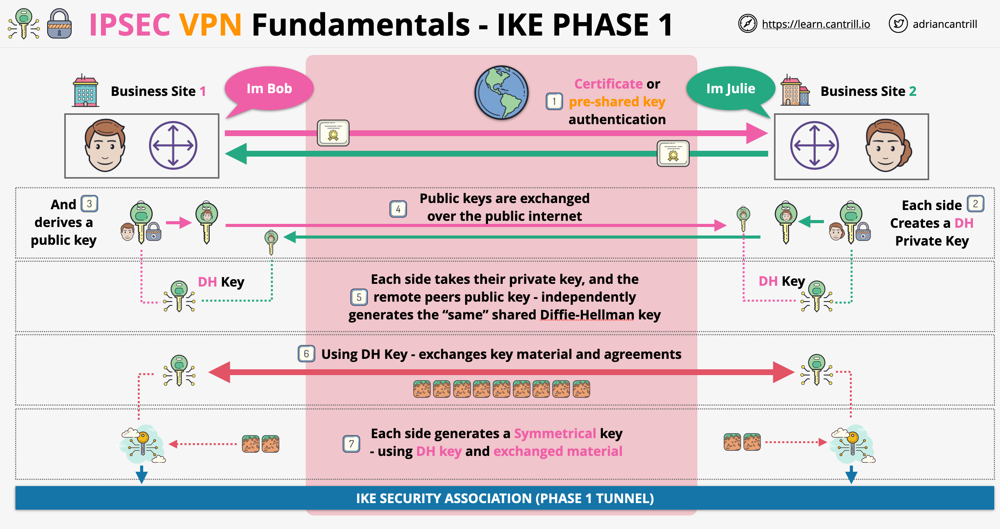
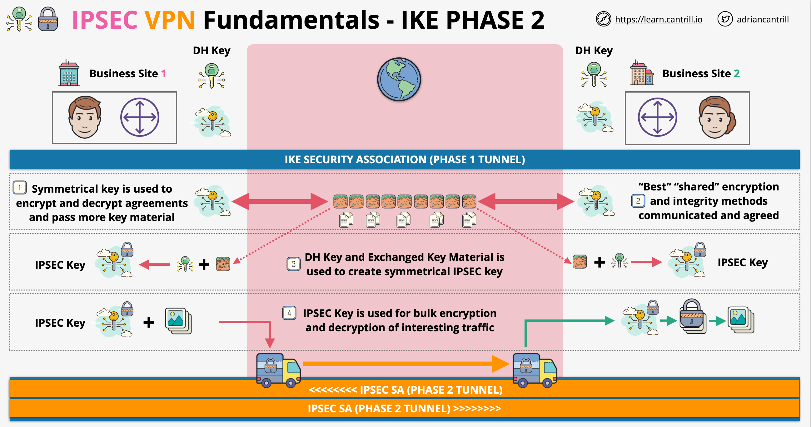
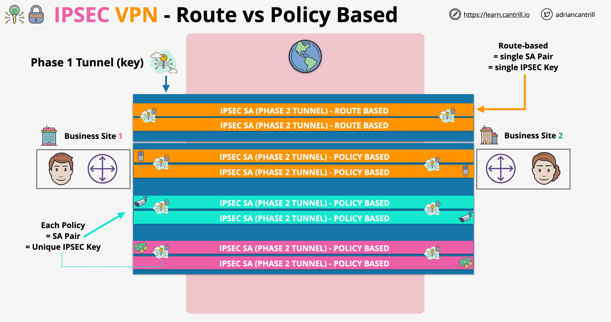

# IPSEC VPN Fundamentals

- IPSEC is a group of protocol aiming to set up secure tunnels across insecure networks
- Use cases: business with 2 locations wanting to connect the locations, connect local infrastructure with cloud based infrastructure
- IPSEC provides authentication, only peers which are known to each other and can authenticate with each other can connect
- IPSEC has two main phases:
    - IKE Phase 1: protocol for key exchange, slow and heavy
        - Uses asymmetric encryption to agree on and create a shared symmetric key
        - The end of this phase is the IKE phase 1 tunnel or an SA (Security Association)
    - IKE Phase 2: faster and agile
        - Uses the keys agreed in phase 1
        - The end of this phase is a phase 2 tunnel which runs over phase 1
    - It is possible to phase 2 tunnel to be created and teared down after it is not used. The phase 1 tunnel can remain
- IPSEC phase1 architecture:

    

- IPSEC phase2 architecture:

    

- There are two types of VPNs - how they match traffic:
    - Policy based VPNs: rule sets match traffic, we can have different rules for different types of traffic
    - Route based VPNs: target matching is done based on prefix. We have a single pair of SA for each traffic

    